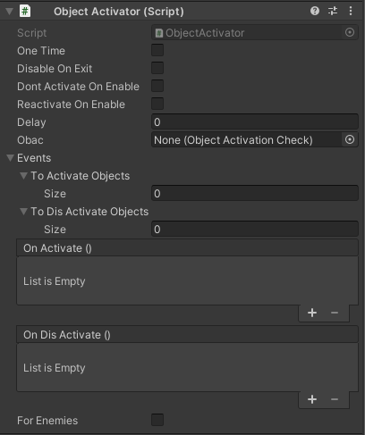

# Object Activator
---

Object Activators are a great way to run a set of events when the Game Object becomes active, or when a player or an enemy enters its collider trigger.

**This Component uses an [ULTRAKILL Event](Components/ULTRAKILL%20Event.md)**

---

## Behaviour
There are two cases that can happen:
- If the Object with this component on it doesn't have any collider, it will run the events when it becomes active.
- If the Object has a collider with a trigger on it, events will only run if a player touches the trigger.

## Fields

### One Time  <!-- {docsify-ignore} -->
Can only be activated **one** time. Further trying to reenter its trigger or reactivating the Game Object beyond the first time will yield no new results.

### Disable On Exit  <!-- {docsify-ignore} -->
If this field is enabled, Events from the [ULTRAKILL Event](/Components/ULTRAKILL%20Event.md) are reverted when either:
- The Game Object becomes inactive
- The Player leaves the Trigger

Objects under `To Activate Objects` become inactive, objects under `To Dis Activate Objects` become active, and `On Dis Activate()` events run.

### Dont Activate On Enable  <!-- {docsify-ignore} -->
If this is enabled, events will not be activated when the object becomes active.

### Reactivate On Enable  <!-- {docsify-ignore} -->
This is required for non-trigger based Object Activators. If you want to run the events every time the Game Object becomes active, this has to be enabled, even if `One Time` is not ticked.

### Delay  <!-- {docsify-ignore} -->
Events will ran after specified amount of time in seconds. Can use decimal numbers. This can be cancelled if the Object Activator gets deactivated (example deactivating the Game Object its on,
or leaving the trigger if [`Disable On Exit`](/Components/Object%20Activator#disable-on-exit) is enabled.)

### OBAC  <!-- {docsify-ignore} -->
Requires a Game Object that has an Object Activation Check component on it. If its status is enabled, the Object Activator will run, otherwise it won't.

The status can be controlled using [ULTRAKILL Events](Components/ULTRAKILL%20Event.md)

### Events  <!-- {docsify-ignore} -->
See [ULTRAKILL Event](Components/ULTRAKILL%20Event.md.md) for further information.

This will be executed based on the conditions descripted in [Behaviour](/Components/Object%20Activator#behaviour).

### For Enemies  <!-- {docsify-ignore} -->
If the Game Object that has an Object Activator also has a trigger on it, it will only be able to be triggered by enemies.

## Functions  <!-- {docsify-ignore} -->
Functions can be called from [ULTRAKILL Events](Components/ULTRAKILL%20Event.md).

### Activate()  <!-- {docsify-ignore} -->
Triggers the events from [Events](Components/ULTRAKILL%20#events) regardless of conditions, without delay.

### ActivateIfActive()  <!-- {docsify-ignore} -->
Triggers the events from [Events](Components/ULTRAKILL%20#events) if conditions are met.

### Deactivate()  <!-- {docsify-ignore} -->
Deactivates the Object Activator, and [reverts the events](Components/ULTRAKILL%20Event.md#on-dis-activate). If [One Time](/Components/Object%20Activator#one-time) was enabled, it resets its state so it can be used again.

---
*Taken from the [Tundra Docs](https://docs.tundra.pitr.dev/components/object-activator/)*
