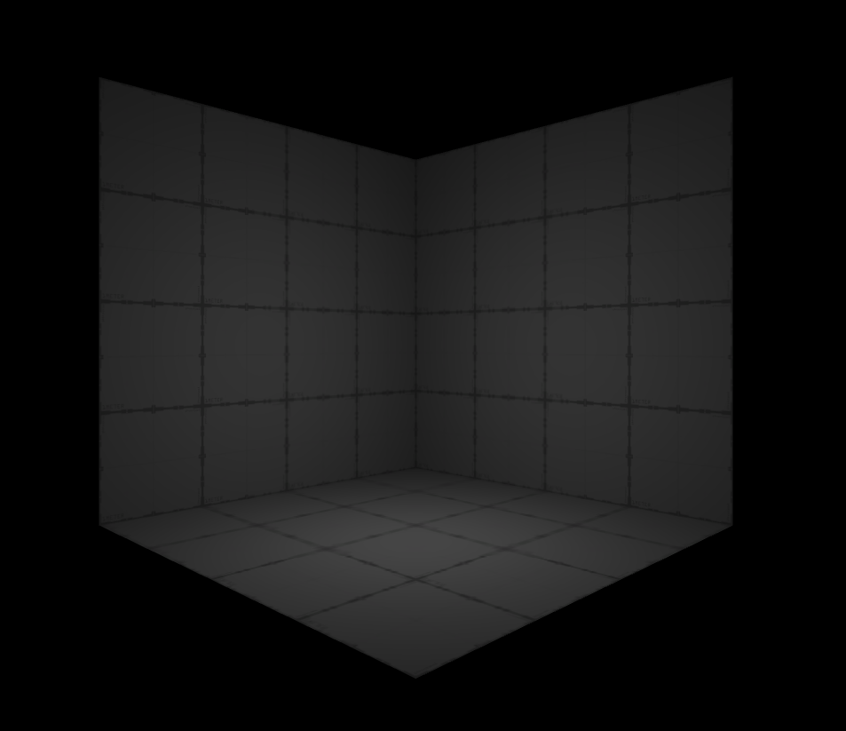
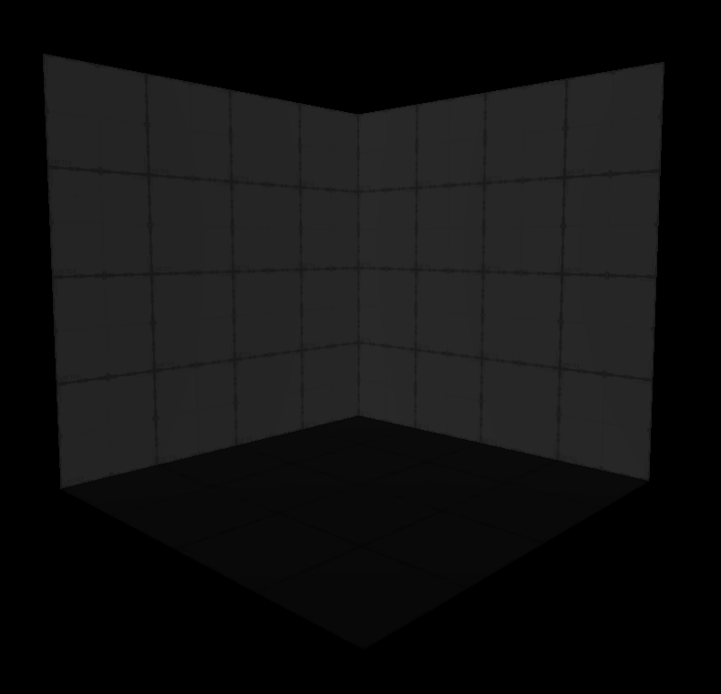
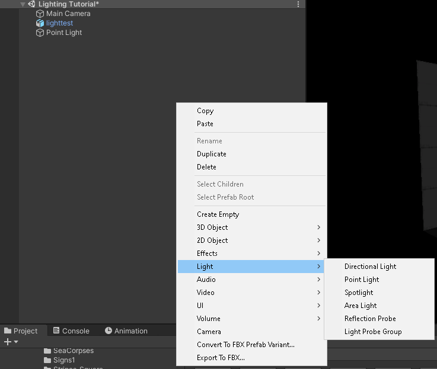
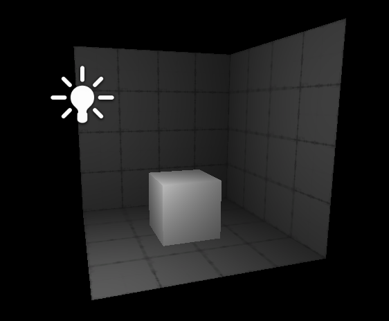
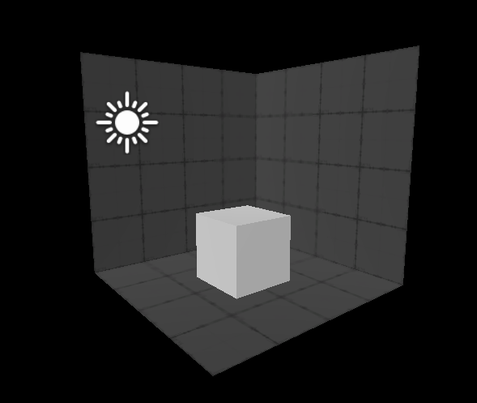
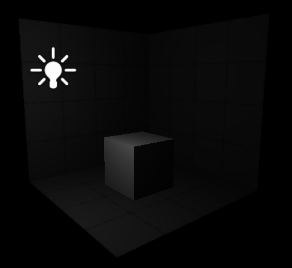
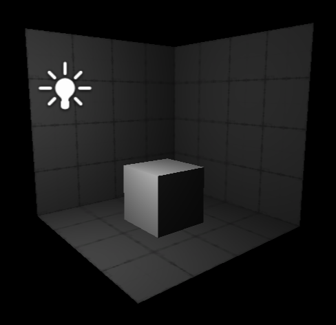

# Lighting 101 (Beginner Tutorial)

This will teach you the basics to [lighting](https://docs.unity3d.com/2019.4/Documentation/Manual/LightingOverview.html) your Ultrakill levels!

## Introduction

*Believe it or not...* lighting is a very important part of level design. It can help set a tone whether that be a happy sunny sky, or a spooky dimly light tunnel.

Lighting can also help you be more effiecent with your detailing proccess, allowing you to mask part of your level in darkness.

A couple things before we begin:
- Every object must have a material, which is well... its material
    - Every material's base is a [`shader`](https://docs.unity3d.com/2019.4/Documentation/Manual/Shaders.html), which in Ultrakill's case are custom-made to help convey the retro theme.
- Ultrakill uses [vertex-lit shading](https://docs.unity3d.com/Manual/shader-NormalVertexLit.html) which basically means the more vertices your object has the *smoother* your lighting will be.
    - However this comes at a cost... the more vertices an object has and therefore more faces, the more performace-heavy it will be
- Ultrakill lighting is slightly different in-game, to see how your lights actually look [build your level](/Quick-Start/Creating%20Levels#exporting-your-level) and test it!
*Vertex-Lit Lighting (Right):*

## Scene Lighting Toggle
The scene lighting toggle; indicated by the button marked in the image below, simply toggles between two lighting modes.

- **Scene Lighting** `Enabled`: Is roughly what your level would look when built and tested in Ultrakill.

- **Scene Lighting** `Disabled`: Shows your level without any lights on and with even lighting, great while creating levels that are dimly lit.

## Basic Lighting

### Adding a Light

To add a light to your scene, simply `🖱 Right Click` in your hierarchy, hover on `Light`, and select the type you want. 

---

### Light Types

Unity has `4` different types of light built in, all with different effects and purposes:

---

### The Point Light

The **Point Light**, lights everything around it uniformly in a spherical shape.

This is the most commonly used type of light for levels, as it is extremely versatile.

---

### The Spot Light
Lights objects in a large conical beam, does essentially the same thing as a real life spotlight. 

---

### The Directional Light

Acts as a Sun, casting uniform light from a specific direction.

Useful for simulating a strong light coming from one direction, or multiple can be used to fully light a level.

---

### The Area Light

Emits even light from a rectangular-shaped area. 

Similar to sun-light coming from a window.

> [!DANGER]
> Area Lights require [baking](https://docs.unity3d.com/2019.4/Documentation/Manual/LightMode-Baked.html), which is not supported by Ultrakill's lighting system, making this type of light unusable!

---

### Light Settings
With a `light` selected, the inspector will show these settings:

*(These may vary slightly for different lights, which I will cover shortly)*

- **Type**: Sets the light-type to: `Point/Spot/Directional/Area`.
- **Range**: Controls how far light from the source will be visible.
    - **Point light** with a range of `10`:

    

    - **Point light** with a range of `25`:

    
- **Color**: Sets the color of the light.
- **Mode**: Sets the rendering mode of the light (**Keep this set to realtime**).
- **Intensity**: Controls the actual brightness of the light.
- **Indirect Multiplier**: Used for [baked lighting](https://docs.unity3d.com/2019.4/Documentation/Manual/LightMode-Baked.html), **not supported by ULTRAKILL**!
- **Shadow Type**: Sets the type of shadows cast by the light (**Set this to No Shadows**).
- **Cookie**: Can be used to create advanced lighting effects, such as masking parts of a light (*Also ignore this one for now!*)
- **Draw Halo**: If enabled, the light will render a spherical halo of light around itself.
- **Flare**: Makes the light emit lens flares.
- **Render Mode**: Sets how important the lights in the scene are. 
    - If lights are marked `Not Important`, they may disappear to save performance (*See the warning below*).
    - If lights are marked `Important`, lights should not have this issue, but keep in mind they are very **performance heavy**, so don't use too many of these.
- **Culling Mask**: Sets what [layers](https://docs.unity3d.com/2019.4/Documentation/Manual/Layers.html) the light affects. Change this if you want a light to only illuminate certain things, otherwise keep it as is.

> [!WARNING]
> Be careful when placing many lights in your level as *Ultrakill will only render a maximum of 8 lights on an object*. Having more lights render can cause lights to flicker as the renderer does not know which of these 8 lights to give priorty.
>
> To bypass this, consider reading the [Optimization Tutorial]() to learn how to dynamically unload & load parts of your level!

---

### Conclusion

---

# PLEASE NOTE THE GUIDE IS UNFINISHED, I WILL FINISH THIS SOON (I wanna go to sleep lmao)

---

*Guide Written by: __tris*

*Adapted & Expanded by: LUKA*

